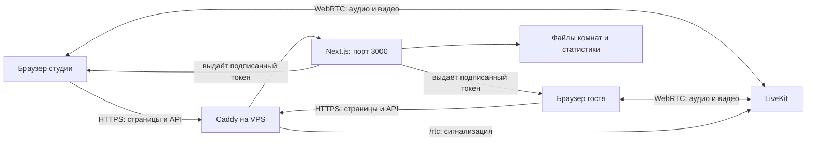

# Как устроен StudioLink

Срез исходников на 26.09.2026. Начните с раздела «Где менять нужную функцию», затем переходите к соответствующим файлам. Пути ниже указаны от корня репозитория. Номера строк быстро меняются: ищите указанные имена функций через Ctrl+Shift+F в VS Code.

## Навигация

- [Общая схема](#общая-схема)
- [Структура файлов](#структура-файлов)
- [Страницы](#страницы)
- [Компоненты](#компоненты)
- [Библиотеки](#библиотеки)
- [Серверные API](#серверные-api)
- [Как проходят звук, видео и вход](#как-проходят-звук-видео-и-вход)
- [Где менять нужную функцию](#где-менять-нужную-функцию)
- [Настройки и данные](#настройки-и-данные)
- [Проверки и известные ограничения](#проверки-и-известные-ограничения)

## Общая схема

Браузер рисует интерфейс React. Next.js отдаёт страницы и обрабатывает `/api/*`: пароли, комнаты, приглашения, токены и статистику. LiveKit передаёт звук и видео по WebRTC. Видеопоток не проходит через обработчик Next.js.

У проекта три разных состояния: файлы на компьютере, коммиты GitHub и запущенный Docker-образ VPS. Сохранение файла обновляет локальную разработку; commit сохраняет историю; push отправляет историю; сборка создаёт приложение; развёртывание заменяет запущенную версию. Эти операции не взаимозаменяемы.

## Структура файлов

| Путь | Назначение |
|---|---|
| `package.json` | Версия проекта, pnpm и команды, перенаправляющие запуск в пакет `web` |
| `pnpm-workspace.yaml` | Области монорепозитория `apps/*`, `packages/*`; `packages` сейчас отсутствует |
| `pnpm-lock.yaml` | Точные версии зависимостей; обновляет pnpm, вручную обычно не редактируют |
| `Dockerfile.web` | Node 22, установка пакетов, Next.js build, запуск web на 3000 |
| `.gitignore` | Исключает секреты, зависимости, сборки, данные и бэкапы из Git |
| `.dockerignore` | Исключает ненужные и приватные файлы из контекста сборки Docker |
| `studiolink.code-workspace` | Подготовленное рабочее пространство редактора |
| `.vscode/tasks.json` | Команды редактора без автоматического развёртывания |
| `.vscode/extensions.json` | Рекомендованные расширения |
| `apps/web` | Всё действующее веб-приложение |
| `apps/studio-linux/CMakeLists.txt`, `src/main.cpp` | Заготовка C++: вывод сообщения, не полноценная студия |
| `apps/studio-windows/CMakeLists.txt`, `src/main.cpp`, `README.md` | Заготовка Win32-окна; описанные планы ещё не реализуют весь функционал |
| `infrastructure/livekit/docker-compose.yml` | Локальный LiveKit с host network; это не полный compose VPS |
| `infrastructure/livekit/livekit.yaml` | Локальная конфигурация LiveKit, исключена из Git |
| `docs/*.md` | Документация; датированные файлы — история отдельных доработок |

В `apps/web/package.json` находятся зависимости и команды Next.js. `next.config.ts` задаёт каталог сборки через `NEXT_BUILD_DIR` и идентификатор через `STUDIOLINK_RELEASE`. Без release генерируется UUID. `tsconfig.json` включает строгую проверку TypeScript и сокращение `@/` для каталога `apps/web`. `next-env.d.ts` создаётся Next.js автоматически.

Не правьте `node_modules`, `.next*`, `*.tsbuildinfo`: это зависимости и результаты работы инструментов. Исходники имеют расширения `.tsx` (TypeScript + разметка JSX), `.ts` (логика), `.css` (дизайн). Тесты `.cjs` запускаются Node.js.

## Страницы

Все пути в таблице относительно `apps/web/`.

| Файл | Адрес и роль |
|---|---|
| `app/layout.tsx` | Общая оболочка, русский язык, подключение CSS LiveKit и затем `globals.css`, уведомление о версии |
| `app/page.tsx` | `/`: переиспользует гостевую страницу |
| `app/room/page.tsx` | `/room`: проверка доступа, имя, устройства, подключение гостя, конференция и настройки |
| `app/studio/page.tsx` | `/studio`: вход студии, выбор комнаты, Studio Return, гости, управление и статистика |
| `app/monitor/page.tsx` | `/monitor?room=…`: наблюдение за комнатой без публикации своего видео |
| `app/output/[identity]/page.tsx` | Чистое видео одного участника для внешнего использования, параметры `room`, `bitrate`, `access` |
| `app/globals.css` | Цвета, кнопки, списки, панели, размеры плиток, адаптация экранов |

### Студия: основные части `app/studio/page.tsx`

- `StudioEntry`: сначала доступ студии, затем выбор/создание комнаты.
- `StudioContent`: состояние комнаты, соединение LiveKit и основная разметка.
- `GuestPreview`: привязывает видеотрек гостя к `<video>` через `attach`; при смене/выходе освобождает через `detach`.
- `GuestAudioMeter`: измеряет звук через Web Audio.
- `refresh`: собирает статистику; основной таймер работает раз в 2 секунды. Индикаторы уровня обновляются через `requestAnimationFrame` чаще.
- `returnFps`, `returnBitrate`: начальные значения 60 и 10000. Получение камеры и публикация — разные этапы.
- «Проверить Studio Return» включает локальный просмотр. ON AIR публикует треки в комнату; OFF AIR снимает публикацию.
- В разметке сначала видеостена, ниже вкладки, устройства, управление, таблицы и статистика.

При правке `useEffect` смотрите и его зависимости, и функцию очистки `return () => …`. Не добавляйте в зависимости постоянно создаваемый объект: эффект может непрерывно перезапускать камеру или соединение. Отписка от событий, очистка таймеров и освобождение треков важны при выходе из комнаты.

### Гость: основные части `app/room/page.tsx`

`GuestAccessGate` проверяет доступ; затем запрашиваются имя и устройства в `AvCheck`. `RoomConnector` подключается, публикует микрофон и камеру, запускает телеметрию и восстановление видео. `GuestConference` переключает обычную конференцию на показ студии согласно режиму комнаты.

Выбор разрешения гостя убран из интерфейса, но камера всё ещё запрашивается как 1280×720, 30 FPS. Это не означает автоматическую отправку Full HD. Идентификатор гостя строится из имени, поэтому одинаковые имена могут конфликтовать.

`output` подписывается только на нужного участника, очищает контейнер перед привязкой видео и при выходе. Его `bitrate` выбирает размер слоя: до 750 — 320×180, до 1800 — 640×360, до 3000 — 1280×720, выше — 1920×1080. Это не точный ограничитель сетевого битрейта.

## Компоненты

Каталог `apps/web/components/`:

| Файл | Что делает |
|---|---|
| `AccessGate.tsx` | Пароль студии и проверка доступа для старого сценария мониторинга |
| `GuestAccessGate.tsx` | Поля комнаты и пароля, вход по инвайту, обработка отказа |
| `StudioRoomPicker.tsx` | Список комнат и создание новой с необязательным паролем |
| `RoomInviteButton.tsx` | Запрашивает приглашение и копирует ссылку; при отказе буфера показывает поле |
| `MediaDevicePicker.tsx` | Три списка устройств; запрос разрешений, `enumerateDevices`, `devicechange`, попытка смены вывода |
| `AudioOutputSelect.tsx` | Отдельный более ранний селектор аудиовыхода; учитывает LiveKit Room и `setSinkId` |
| `MonitoringControls.tsx` | Локальное включение звука, видео и громкость участника |
| `StatisticsDashboard.tsx` | Графики SVG, выбор периода/сессии, опрос каждые 15 секунд, CSV |
| `AppUpdateNotice.tsx` | Проверка версии раз в минуту и при возврате фокуса; предлагает ручное обновление |
| `ThemeToggle.tsx` | Тёмная/светлая тема через `data-theme` и `localStorage` |

Компонент получает значения и обработчики через `props`. Само наличие списка устройств ещё не означает переключение отправляемого трека: родитель должен обработать выбор и обновить поток.

## Библиотеки

Каталог `apps/web/lib/`:

| Файл | Ответственность |
|---|---|
| `access.ts` | Scrypt-хэши паролей, подпись сессий HMAC, cookies, проверка origin и прав |
| `room-store.ts` | JSON-список комнат, пароль и `studioOnly`; последовательная запись через временный файл |
| `room-mode.ts` | Опрос режима комнаты раз в секунду; пока ответ не получен, режим ограничен студией |
| `livekit-url.ts` | Адрес сигнализации LiveKit; для localhost:3000 использует настроенный публичный URL, иначе адрес сайта |
| `video-quality.ts` | FPS 25/30/50/60, битрейты 500–10000, ограничения камеры и параметры публикации |
| `personal-monitoring.ts` | Личные настройки прослушивания по комнате, подписки и ограничения режима студии |
| `monitor-audio.ts` | Применение громкости и mute к аудиоэлементам трека и освобождение привязок |
| `studio-video-recovery.ts` | Каждые 5 секунд проверяет декодирование; после трёх остановок пробует переподписку |
| `rtc-telemetry.ts` | Сбор WebRTC-статистики каждые 10 секунд, отправка и продление токена |
| `telemetry-types.ts` | Форматы данных статистики и вспомогательные расчёты |
| `telemetry-store.ts` | Почасовые JSONL, хранение около 26 часов, агрегация истории, отметки очистки |
| `stats-csv.ts` | Экспорт статистики в CSV |
| `app-update.ts` | Сравнение версий и URL обновления с сохранением остальных параметров |

## Серверные API

Каждая строка соответствует `apps/web/app/api/<имя>/route.ts`. API выполняется на сервере, а не в браузере.

| Маршрут | Методы и назначение |
|---|---|
| `auth` | GET — проверка сессии; POST — пароль/инвайт; DELETE — выход студии. Ограничение попыток хранится в памяти процесса |
| `rooms` | GET — список для студии либо данные комнаты; POST — создать, переименовать, удалить, изменить режим |
| `invites` | POST — подписанное приглашение на 30 дней, требует студийный доступ |
| `token` | GET — LiveKit JWT примерно на 2 часа; права зависят от роли guest/studio-panel/monitor/output |
| `participants` | DELETE — отключение участника через LiveKit Server SDK |
| `move-guest` | POST — команда переноса гостя; временный файл ожидает получения |
| `guest-command` | GET — гость забирает команду переноса, срок команды 30 секунд |
| `stats` | POST — образцы; GET — история; DELETE — отметка очистки отключённых. Проверяются токен и нужные права |
| `version` | GET без кеша — версия текущей сборки; при отсутствии BUILD_ID возможен 503 |

Изменение пароля в JSX не обеспечивает защиту: доступ проверяется в API и в `access.ts`. У студии своя сессия, у гостя — доступ к конкретной комнате. Инвайт намеренно заменяет ввод пароля; обычный вход должен проверять пароль. Приглашение связано с состоянием пароля комнаты и может стать недействительным после его изменения.

## Как проходят звук, видео и вход

1. Гость вводит комнату/пароль либо открывает инвайт. Сервер выдаёт доступ через cookie.
2. После имени и выбора устройств браузер получает LiveKit-токен и подключается.
3. `getUserMedia` получает поток устройства. Он может отличаться от желаемого разрешения.
4. Публикация LiveKit задаёт предел битрейта и FPS. Simulcast создаёт несколько качеств для разных получателей.
5. Получатель подписывается на трек; `attach` привязывает его к медиаэлементу. Локальный mute не выключает микрофон отправителя.
6. При уходе удаляется участник, отписываются обработчики и очищается видео.

1920×1080 / 60 FPS / 10000 кбит/с — целевые настройки студии, а не гарантия фактического потока. `ideal` допускает иной формат устройства; `exact` отклоняет несовместимый источник. Битрейт — верхний предел, на статичной картинке он ниже. FPS зависит от камеры, света, браузера и нагрузки. Проверять нужно фактическую статистику отправки и приёма, отдельно от выбранного значения.

## Где менять нужную функцию

| Хочу изменить | Начать здесь | Проверить после правки |
|---|---|---|
| Текст/порядок кнопок студии | `app/studio/page.tsx`, поиск текста кнопки | Кнопки сохранили обработчики, режимы работают |
| Кнопки, списки, цвета | `app/globals.css`, переменные темы в начале | Обе темы, focus клавиатурой, мобильный экран |
| Размер и положение видео | `globals.css`: `studio-video-wall`, `studio-video-card`, `guest-conference-grid`, `studio-only-grid`; JSX обеих страниц | 360/768/1920 px, один/несколько гостей, режим студии |
| FPS и битрейт студии | `video-quality.ts` и `returnFps`/`returnBitrate` страницы студии | Захват, публикация, статистика согласованы |
| Камеру или микрофон гостя | `room/page.tsx`: `AvCheck`, `RoomConnector` | Выбор до входа и после входа отдельно |
| Выбор наушников | `MediaDevicePicker.tsx`, `AudioOutputSelect.tsx` | Доступность браузерного API и звук нового участника |
| Вход и инвайты | Компоненты доступа + API `auth`, `invites`, `token` + `access.ts` | Неверный пароль, верный пароль, инвайт, истёкший инвайт |
| Создание/режим комнаты | `StudioRoomPicker`, API `rooms`, `room-store`, `room-mode` | Два клиента одновременно, переключение и перезаход |
| Застывшее видео | `GuestPreview`, `studio-video-recovery`, обработчики выхода | Отключить сеть, выйти, вернуться; треки освобождаются |
| Графики | `StatisticsDashboard`, библиотеки telemetry, API `stats` | Единицы измерения, период, CSV |
| Уведомление о версии | `AppUpdateNotice`, `app-update`, `next.config`, API `version` | Разные release, сохранение комнаты в URL |

CSS читается сверху вниз с учётом специфичности. В конце `globals.css` есть более поздние адаптивные переопределения. Если изменение «не работает», найдите все совпадения селектора и посмотрите Computed/Styles в DevTools. Не меняйте глобально все `video`: чистый `output` и превью имеют разные задачи. Сначала одна небольшая правка, затем проверка.

## Настройки и данные

| Настройка | Назначение |
|---|---|
| `LIVEKIT_API_KEY`, `LIVEKIT_API_SECRET` | Серверные ключи; секрет также участвует в подписи доступа |
| `NEXT_PUBLIC_LIVEKIT_URL` | Адрес LiveKit для клиента; значения NEXT_PUBLIC доступны браузеру |
| `LIVEKIT_SERVER_URL` | Серверный URL управления участниками, по умолчанию localhost:7880 |
| `STUDIOLINK_STUDIO_PASSWORD_HASH` | Хэш пароля студии |
| `STUDIOLINK_ROOMS_FILE` | Файл комнат, по умолчанию `/tmp/studiolink-rooms.json` |
| `STUDIOLINK_STATS_DIR` | Каталог истории, по умолчанию `.studiolink-data/stats` относительно процесса |
| `NEXT_BUILD_DIR` | Один и тот же каталог при build и start |
| `STUDIOLINK_RELEASE` | Идентификатор новой сборки; используйте новое значение для нового выпуска |

Локальные секреты находятся в `apps/web/.env.local`. Они не должны попасть в GitHub, Issue или скриншот. Не публикуйте содержимое env-файлов и инвайтов. Репозиторий сейчас публичный.

SQL-базы в текущей реализации нет. Комнаты — JSON; статистика — JSONL, не запись видео. Команды перемещения — временные файлы `/tmp/studiolink-moves`. Настройки темы и личного мониторинга остаются в браузере. Бэкап Git не заменяет бэкап серверных данных и конфигурации.

По ранее настроенному развёртыванию VPS использует `/opt/studiolink/docker-compose.yml`, `Caddyfile`, `web.env`, каталоги `data`, `releases`, `backups`. В web-контейнер монтируются `/data` и постоянный каталог runtime на `/tmp`. Эти пути надо подтвердить командой из [диагностики](TROUBLESHOOTING_RU.md) перед изменением: текущая сессия проверяла публичную версию, а не содержимое VPS. Локальный compose из `infrastructure` нельзя подставлять вместо серверного.

## Проверки и известные ограничения

Все тесты лежат в `apps/web/tests/`:

| Файл | Проверяет |
|---|---|
| `monitor-audio.cjs` | Привязку локальной громкости и mute |
| `video-quality.cjs` | FPS, ограничения и перевод кбит/с в бит/с |
| `telemetry.cjs` | Обработку и хранение статистики |
| `studio-video-recovery.cjs` | Восстановление замершего трека |
| `room-mode-monitoring.cjs` | Подписки и режим студии |
| `app-update.cjs` | Версии и адрес обновления |
| `guest-entry.cjs` | Форму доступа и переходы по инвайту |
| `app-update-notice.cjs` | Компонент уведомления об обновлении |
| `guest-access-api.cjs` | Вход и права через запущенный изолированный сервер |
| `stats-api.cjs` | API статистики через изолированный сервер |
| `app-update-api.cjs` | Версию собранного приложения через сервер |

API-тесты требуют специально подготовленного сервера с тестовыми секретами, отдельными файлами данных и `TEST_BASE_URL`; некоторые создают/удаляют комнаты. Не направляйте их на рабочий сайт. Общей команды `pnpm test` сейчас нет. `lint` с `next lint` не использовать как подтверждённую проверку для этой версии Next.js.

На момент анализа есть две незакоммиченные ручные правки: `video-quality.ts` (`exact` → `ideal`) и `studio/page.tsx` (дополнительный detach и дедупликация гостей). Их успешность на реальных устройствах ещё не подтверждена. `video-quality.cjs` ожидает прежний `exact`, поэтому падает; нельзя объявлять такую проверку успешной. `app-update-notice.cjs` падает на импорте `@/components/ThemeToggle`: тестовому загрузчику не хватает разрешения импорта.

Другие замеченные по коду ограничения:

- В гостевой форме до входа обработаны все устройства, а у селектора внутри комнаты подключён только обработчик наушников. Видимые списки камеры/микрофона там сами по себе не переключают отправку.
- Переключение аудиовыхода зависит от браузера и применено к существующим медиаэлементам; новые элементы нужно проверять отдельно. Ошибки части вызовов подавляются.
- Режим «только студия» реализован клиентскими подписками/интерфейсом, а не строгой изоляцией потоков на SFU.
- Частое обновление показателей гостей не доказывает появление лишних DOM-плиток. «Картинка внутри картинки» может быть обратной связью vMix, если его выход захватывает саму страницу студии. Это отдельная гипотеза, не подтверждённый диагноз.

Датированные документы `features-20260925.md`, `av-fixes-20260926.md`, `guest-access-20260926.md`, `updates-20260926.md`, `responsive-layout-v0.9.1.md` полезны для истории замысла. При расхождении ориентируйтесь на текущий код и фактическую проверку.
